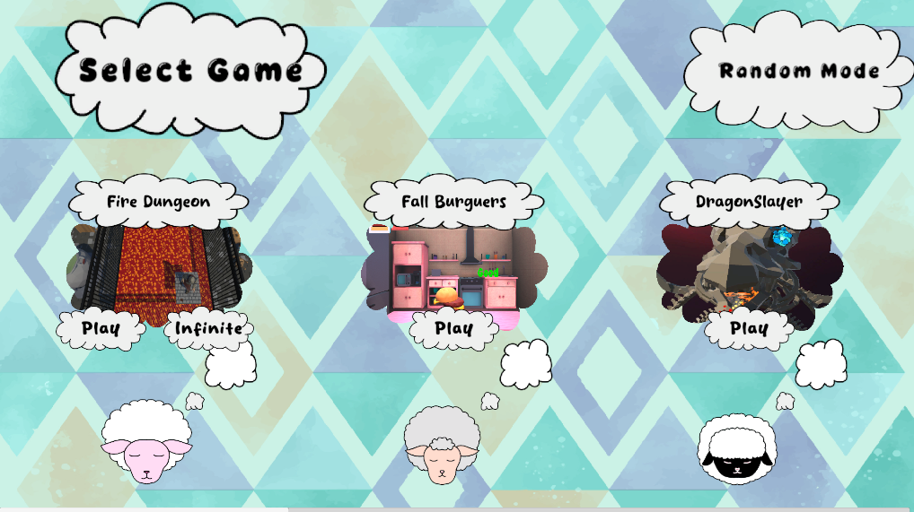
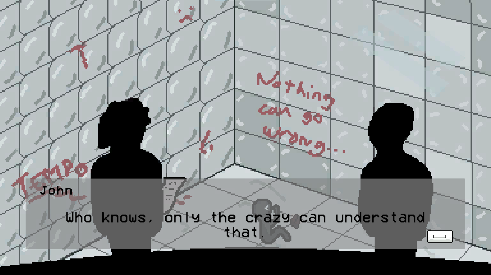
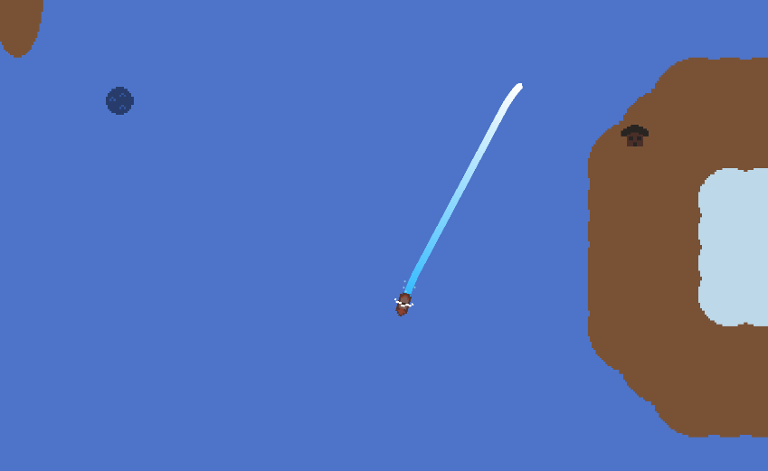
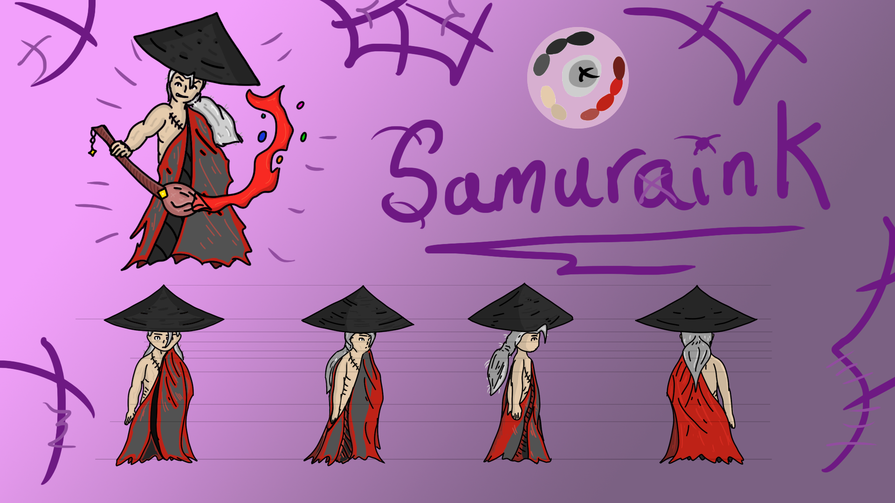
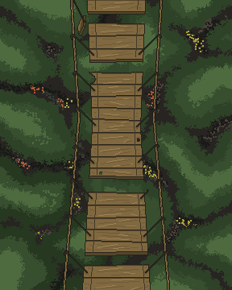

# 👋 ¡Hola! Soy Juan Manuel, aunque mi alias es Void Watcher.

🎮 Desarrollador de videojuegos indie en proceso.  
🔧 Trabajo con Unity, aunque también conozco Godot.       
👔 También estudié desarrollo de aplicaciones multiplataforma, pero no suelo crear por mi cuenta.

---

## 🕹️ Proyectos Destacados
 
### [🔗 Dream Party](https://dokozak.itch.io/ficzone-2025)
*Una compilación de minijuegos con diferentes jugabilidades.*  
*Este juego fue creado en grupo con varios compañeros de clase para el evento Ficzone, donde presentamos el juego.*            
**Rol:** Crear varios minijuegos, y algunos menus.
**Herramientas:** Unity y Blender  

### [🔗 Tempo Keeper](https://juanmasg.itch.io/tempo-keeper)
*Un corto juego donde hay que mantener un ritmo constante mientras minijuegos intentan distraerte, creado para una GameJam de 1 semana.*  
**Rol:** Todo, el juego lo realicé yo en su totalidad.
**Herramientas:** Unity y Aseprite

### [🔗 Ocean's Gloom](https://juanmasg.itch.io/oceans-gloom)
*Un juego de pesca donde exploras océanos prohibidos, fue mi primer juego y fue un proyecto de clase.*  
**Rol:** Todo, el juego lo realicé yo en su totalidad.
**Herramientas:** Unity y Aseprite

---

## 📂 Tecnologías y herramientas

- Unity (nivel intermedio)
- C#
- Git & GitHub
- Aseprite, Blender, Photoshop

---

## 📫 Contacto

- 📧 **Email:** juanmasg55@email.com  
- 💼 [LinkedIn](https://linkedin.com/in/juanma-salinas-gonzález)  
- 🐙 [GitHub](https://github.com/juanmasg-dev)  
- 🎮 [Itch.io](https://juanmasg.itch.io)

---

> *“Los videojuegos son la mejor forma de experimentar la creatividad de otra persona”*

---
### Aquí va un pequeño portfolio de arte:
*Dream Party*  
  
*Tempo Keeper*  
  
*Ocean's Gloom*  
  
*Una guía de estilos de un personaje creado en clase*  
  
*Una prueba de pixelart*  
  
